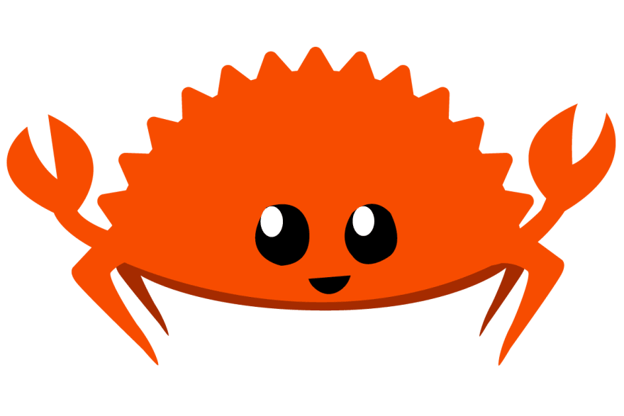

+++
title = "Images, Direct and Relative Path"
date = 2021-05-08

[taxonomies]
categories = ["Features"]
tags = ["images"]
+++

Images can be embed using direct or relative paths.
<!-- more -->
Use `img()` to specify the relative path of image:

{{ img(path="./image.jpg", alt="") }}

This is an example note with direct image, without using shortcode:

This is an svg image:

<svg class="canon" xmlns="http://www.w3.org/2000/svg" overflow="visible" viewBox="0 0 496 373" height="373" width="496"><g fill="none"><path stroke="#000" stroke-width=".75" d="M.599 372.348L495.263 1.206M.312.633l494.95 370.853M.312 372.633L247.643.92M248.502.92l246.76 370.566M330.828 123.869V1.134M330.396 1.134L165.104 124.515"></path><path stroke="#ED1C24" stroke-width=".75" d="M275.73 41.616h166.224v249.05H275.73zM54.478 41.616h166.225v249.052H54.478z"></path><path stroke="#000" stroke-width=".75" d="M.479.375h495v372h-495zM247.979.875v372"></path><ellipse cx="498.729" cy="177.625" rx=".75" ry="1.25"></ellipse><ellipse cx="247.229" cy="377.375" rx=".75" ry="1.25"></ellipse></g></svg>

